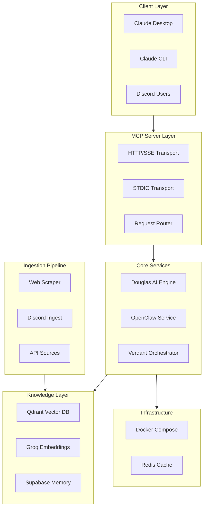
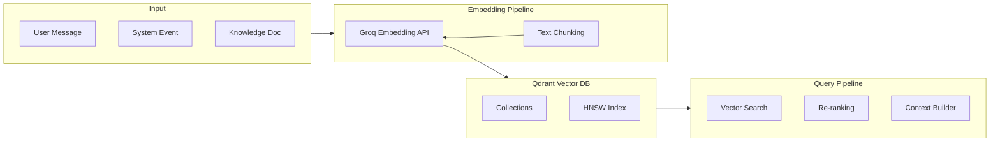
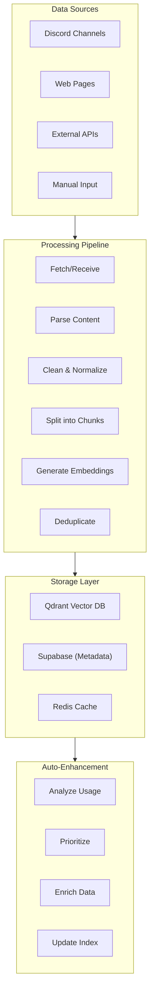

# Anti-Gravity AI Knowledge Base Architecture

## Technical Specification Document

**Project**: SWAGCLAW - Advanced MCP Knowledge Base Integration  
**Version**: 1.0.0  
**Date**: 2026-03-11  
**Author**: Architect Mode  
**Status**: Specification Complete  

---

## 1. Executive Summary

This document specifies a comprehensive architecture for integrating MCP (Model Context Protocol) server capabilities with the existing SWAGCLAW Discord bot (DOUGLAS). The system leverages Qdrant vector database for semantic knowledge storage, Docker containerization for deployment, and an auto-enhancing memory system for continuous AI improvement.

### Key Components

- **MCP Server**: Full Model Context Protocol implementation with tools, resources, and prompts
- **Qdrant Integration**: Semantic vector search using Groq API embeddings (768 dimensions)
- **Docker Compose**: Self-contained deployment with all dependencies
- **Knowledge Pipeline**: Automated ingestion from multiple sources
- **Auto-Enhancement**: Self-improving brain system for Douglas

---

## 2. System Architecture Overview



---

## 3. MCP Server Architecture

### 3.1 Protocol Implementation

The MCP server implements the full Model Context Protocol specification with bidirectional communication capabilities.

#### Transport Layer

| Transport | Port | Use Case |
|-----------|------|----------|
| HTTP/SSE | 3001 | Claude Desktop connections |
| STDIO | N/A | Claude CLI local mode |
| WebSocket | 3002 | Real-time Discord sync |

#### Server Configuration

```javascript
// src/services/mcp/server.js
const MCPServerConfig = {
  name: 'swagclaw-mcp',
  version: '1.0.0',
  capabilities: {
    tools: true,
    resources: true,
    prompts: true,
    logging: true
  },
  transports: {
    http: { port: 3001, sse: true },
    stdio: { enabled: true },
    websocket: { port: 3002 }
  }
};
```

### 3.2 Tool Definitions

The MCP server exposes the following tools for Claude integration:

#### Douglas Tools

| Tool | Description | Parameters |
|------|-------------|------------|
| `douglas_chat` | Send message to Douglas AI | `message: string`, `context?: object` |
| `douglas_remember` | Store fact in memory | `key: string`, `value: object` |
| `douglas_recall` | Retrieve stored fact | `key: string` |
| `douglas_search` | Semantic knowledge search | `query: string`, `limit?: number` |
| `douglas_heartbeat` | Trigger proactive message | - |

#### Knowledge Tools

| Tool | Description | Parameters |
|------|-------------|------------|
| `ingest_url` | Scrape and ingest web content | `url: string` |
| `ingest_discord` | Ingest Discord channel history | `channel_id: string`, `limit?: number` |
| `search_knowledge` | Semantic search across KB | `query: string`, `filters?: object` |
| `list_collections` | List knowledge collections | - |

### 3.3 Resource Definitions

Resources expose knowledge base data to Claude:

| Resource | URI | Description |
|----------|-----|-------------|
| Douglas Profile | `douglas://profile` | Bot identity and capabilities |
| Memory Index | `memory://index` | All stored memories |
| Knowledge Stats | `knowledge://stats` | Vector DB statistics |
| System Health | `system://health` | Service health status |

### 3.4 Prompt Templates

Predefined prompts for common operations:

```javascript
// src/services/mcp/prompts.js
const MCPPrompts = {
  'douglas-intro': {
    description: 'Introduce Douglas to a new user',
    arguments: [{ name: 'username', required: false }]
  },
  'knowledge-search': {
    description: 'Search the knowledge base with context',
    arguments: [
      { name: 'topic', required: true },
      { name: 'context', required: false }
    ]
  },
  'memory-consult': {
    description: 'Consult memory about past interactions',
    arguments: [{ name: 'topic', required: true }]
  }
};
```

### 3.5 MCP Client Configuration

Claude Desktop `mcp_settings.json`:

```json
{
  "mcpServers": {
    "swagclaw": {
      "command": "node",
      "args": ["src/services/mcp/server.js"],
      "env": {},
      "url": "http://localhost:3001/sse"
    }
  }
}
```

---

## 4. Docker Containerization

### 4.1 Docker Compose Configuration

```yaml
# docker-compose.yml
version: '3.9'

services:
  # Main SWAGCLAW Application
  swagclaw:
    build:
      context: .
      dockerfile: Dockerfile
    container_name: swagclaw
    ports:
      - "3000:3000"  # Express API
      - "3001:3001"  # MCP HTTP/SSE
      - "3002:3002"  # MCP WebSocket
    env_file:
      - .env
    volumes:
      - ./src:/app/src
      - ./logs:/app/logs
    depends_on:
      - redis
      - ollama
    networks:
      - swagclaw-net
    restart: unless-stopped
    healthcheck:
      test: ["CMD", "curl", "-f", "http://localhost:3000/health"]
      interval: 30s
      timeout: 10s
      retries: 3

  # Redis for caching and pub/sub
  redis:
    image: redis:7-alpine
    container_name: swagclaw-redis
    ports:
      - "6379:6379"
    volumes:
      - redis-data:/data
    networks:
      - swagclaw-net
    command: redis-server --appendonly yes
    restart: unless-stopped

  # Ollama for local embeddings
  ollama:
    image: ollama/ollama:latest
    container_name: swagclaw-ollama
    ports:
      - "11434:11434"
    volumes:
      - ollama-data:/root/.ollama
    networks:
      - swagclaw-net
    environment:
      - OLLAMA_HOST=0.0.0.0
    restart: unless-stopped

  # Qdrant Vector Database (Cloud - External)
  # Note: Using existing cloud instance
  # qdrant:
  #   image: qdrant/qdrant:latest
  #   ports:
  #     - "6333:6333"
  #   volumes:
  #     - qdrant-data:/qdrant/storage

  # Nginx reverse proxy
  nginx:
    image: nginx:alpine
    container_name: swagclaw-nginx
    ports:
      - "80:80"
      - "443:443"
    volumes:
      - ./nginx/nginx.conf:/etc/nginx/nginx.conf:ro
      - ./nginx/ssl:/etc/nginx/ssl:ro
    depends_on:
      - swagclaw
    networks:
      - swagclaw-net
    restart: unless-stopped

networks:
  swagclaw-net:
    driver: bridge

volumes:
  redis-data:
  ollama-data:
```

### 4.2 Dockerfile

```dockerfile
# Dockerfile
FROM node:20-alpine

WORKDIR /app

# Install dependencies
COPY package*.json ./
RUN npm ci --production

# Copy application code
COPY src ./src
COPY *.json ./
COPY *.md ./
COPY .env.example .env

# Create logs directory
RUN mkdir -p logs

# Expose ports
EXPOSE 3000 3001 3002

# Health check
HEALTHCHECK --interval=30s --timeout=10s --start-period=40s --retries=3 \
  CMD node -e "require('http').get('http://localhost:3000/health', (r) => process.exit(r.statusCode === 200 ? 0 : 1))"

# Start application
CMD ["node", "src/index.js"]
```

### 4.3 Docker Commands

```bash
# Development
docker-compose up -d
docker-compose logs -f swagclaw

# Production
docker-compose -f docker-compose.yml up -d --build

# Stop all
docker-compose down

# Rebuild
docker-compose up -d --build --force-recreate
```

---

## 5. Qdrant Persistent Memory System

### 5.1 Architecture



### 5.2 Collection Schema

```javascript
// src/services/qdrant/client.js
const COLLECTION_CONFIG = {
  // Douglas Conversations Collection
  conversations: {
    name: 'douglas_conversations',
    vector_size: 768,
    distance: 'Cosine',
    hnsw_config: {
      m: 16,
      ef_construct: 100
    }
  },
  
  // Knowledge Base Collection
  knowledge: {
    name: 'swagclaw_knowledge',
    vector_size: 768,
    distance: 'Cosine',
    hnsw_config: {
      m: 16,
      ef_construct: 100
    }
  },
  
  // User Profiles Collection
  users: {
    name: 'douglas_users',
    vector_size: 768,
    distance: 'Cosine',
    hnsw_config: {
      m: 8,
      ef_construct: 64
    }
  }
};
```

### 5.3 Point Structure

```typescript
interface KnowledgePoint {
  id: string;
  vector: number[];           // 768-dim embedding
  payload: {
    // Content
    content: string;
    title?: string;
    source: string;
    source_type: 'discord' | 'web' | 'api' | 'memory' | 'manual';
    
    // Metadata
    created_at: string;
    updated_at: string;
    tags: string[];
    collection: string;
    
    // Context
    author_id?: string;
    channel_id?: string;
    guild_id?: string;
    
    // Enhancement
    importance: number;        // 0-1
    access_count: number;
    last_accessed: string;
  };
  score?: number;              // Search result score
}
```

### 5.4 Qdrant Service Implementation

```javascript
// src/services/qdrant/index.js
const { QdrantClient } = require('@qdrant/js-client-rest');

class QdrantService {
  constructor() {
    this.client = new QdrantClient({
      url: process.env.QDRANT_URL,
      apiKey: process.env.QDRANT_API_KEY
    });
    this.embeddingModel = 'BAAI/bge-base-en-v1.5'; // Fallback to Ollama
  }

  /**
   * Generate embedding using Groq API
   */
  async generateEmbedding(text) {
    const response = await axios.post(
      'https://api.groq.com/openai/v1/embeddings',
      {
        model: 'text-embedding-3-large',
        input: text
      },
      {
        headers: {
          'Authorization': `Bearer ${process.env.GROQ_API_KEY}`,
          'Content-Type': 'application/json'
        }
      }
    );
    return response.data.data[0].embedding;
  }

  /**
   * Store knowledge in vector DB
   */
  async storeKnowledge(points) {
    const collectionName = points[0].payload.collection || 'swagclaw_knowledge';
    
    await this.client.upsert(collectionName, {
      wait: true,
      points: points.map(p => ({
        id: p.id,
        vector: p.vector,
        payload: p.payload
      }))
    });
    
    return { stored: points.length, collection: collectionName };
  }

  /**
   * Semantic search
   */
  async semanticSearch(query, options = {}) {
    const {
      collection = 'swagclaw_knowledge',
      limit = 5,
      scoreThreshold = 0.7,
      filter = {}
    } = options;

    // Generate query embedding
    const queryVector = await this.generateEmbedding(query);

    // Search
    const results = await this.client.search(collectionName, {
      vector: queryVector,
      limit,
      score_threshold: scoreThreshold,
      filter: filter,
      with_payload: true
    });

    return results;
  }

  /**
   * Update point metadata (for auto-enhancement)
   */
  async updatePointAccess(pointId, collection) {
    const point = await this.client.retrieve(collectionName, {
      ids: [pointId]
    });

    if (point) {
      const updated = {
        ...point[0],
        payload: {
          ...point[0].payload,
          access_count: (point[0].payload.access_count || 0) + 1,
          last_accessed: new Date().toISOString()
        }
      };

      await this.client.upsert(collectionName, {
        points: [updated]
      });
    }
  }
}

module.exports = new QdrantService();
```

---

## 6. Knowledge Ingestion Pipeline

### 6.1 Pipeline Architecture



### 6.2 Ingestion Sources

#### Discord Ingestion

```javascript
// src/services/ingestion/discord.js
class DiscordIngestion {
  async ingestChannel(client, channelId, options = {}) {
    const { limit = 100, fromMessageId = null } = options;
    
    const channel = await client.channels.fetch(channelId);
    const messages = await channel.messages.fetch({
      limit,
      before: fromMessageId
    });

    const chunks = [];
    for (const [id, message] of messages) {
      if (message.author.bot) continue;
      
      chunks.push({
        content: message.content,
        metadata: {
          message_id: id,
          author: message.author.username,
          author_id: message.author.id,
          channel: channel.name,
          channel_id: channelId,
          timestamp: message.createdAt.toISOString(),
          source_type: 'discord'
        }
      });
    }

    return this.processChunks(chunks);
  }
}
```

#### Web Scraper Ingestion

```javascript
// src/services/ingestion/web.js
class WebIngestion {
  async ingestURL(url, options = {}) {
    const { selectors = ['article', 'main', '.content'], maxDepth = 2 } = options;
    
    // Fetch and parse
    const response = await axios.get(url, {
      headers: { 'User-Agent': 'SWAGCLAW-Bot/1.0' }
    });
    
    const $ = cheerio.load(response.data);
    
    // Extract content
    const title = $('title').text();
    const content = selectors
      .map(s => $(s).text())
      .join('\n\n')
      .substring(0, 10000); // Limit chunk size
    
    // Extract metadata
    const metadata = {
      url,
      title,
      description: $('meta[name="description"]').attr('content'),
      source_type: 'web',
      crawled_at: new Date().toISOString()
    };

    return this.processChunks([{ content, metadata }]);
  }
}
```

### 6.3 Text Processing Pipeline

```javascript
// src/services/ingestion/processor.js
class TextProcessor {
  /**
   * Clean and normalize text
   */
  clean(text) {
    return text
      .replace(/\s+/g, ' ')
      .replace(/[^\x20-\x7E\n]/g, '')
      .trim();
  }

  /**
   * Split text into semantic chunks
   */
  chunk(text, options = {}) {
    const {
      chunkSize = 500,
      overlap = 50,
      separator = '\n\n'
    } = options;

    const chunks = [];
    const paragraphs = text.split(separator);
    let currentChunk = '';

    for (const paragraph of paragraphs) {
      if ((currentChunk + paragraph).length > chunkSize) {
        if (currentChunk) chunks.push(currentChunk);
        // Keep overlap from previous chunk
        currentChunk = currentChunk.slice(-overlap) + paragraph;
      } else {
        currentChunk += separator + paragraph;
      }
    }

    if (currentChunk) chunks.push(currentChunk);
    return chunks;
  }

  /**
   * Process and store chunks
   */
  async processChunks(items) {
    const qdrant = require('../qdrant');
    const points = [];

    for (const item of items) {
      const chunks = this.chunk(this.clean(item.content));
      
      for (const chunk of chunks) {
        const vector = await qdrant.generateEmbedding(chunk);
        
        points.push({
          id: crypto.randomUUID(),
          vector,
          payload: {
            content: chunk,
            ...item.metadata,
            chunk_index: chunks.indexOf(chunk),
            total_chunks: chunks.length
          }
        });
      }
    }

    // Store in Qdrant
    await qdrant.storeKnowledge(points);
    
    return { processed: items.length, chunks: points.length };
  }
}
```

---

## 7. Auto-Enhancement System

### 7.1 System Overview

The auto-enhancement system continuously improves Douglas's knowledge and responses through:

1. **Usage Analytics**: Track which knowledge is accessed most
2. **Importance Scoring**: Rank knowledge by relevance
3. **Context Enrichment**: Add related information
4. **Periodic Updates**: Refresh embeddings and metadata

### 7.2 Enhancement Pipeline

```javascript
// src/services/enhancement/engine.js
class AutoEnhancement {
  constructor() {
    this.enhancementInterval = 24 * 60 * 60 * 1000; // Daily
    this.minImportance = 0.3;
    this.maxPoints = 1000;
  }

  /**
   * Main enhancement cycle
   */
  async runEnhancementCycle() {
    console.log('🔄 Starting enhancement cycle...');
    
    // 1. Analyze usage patterns
    const usageStats = await this.analyzeUsage();
    
    // 2. Calculate importance scores
    const importanceUpdates = await this.calculateImportance(usageStats);
    
    // 3. Find related knowledge
    await this.enrichWithRelated();
    
    // 4. Prune low-value knowledge
    await this.pruneKnowledge();
    
    console.log('✓ Enhancement cycle complete');
  }

  /**
   * Analyze usage patterns
   */
  async analyzeUsage() {
    const qdrant = require('../qdrant');
    
    const stats = {
      highAccess: [],
      mediumAccess: [],
      lowAccess: [],
      noAccess: []
    };

    // Fetch all points and categorize
    const allPoints = await qdrant.getAllPoints();
    
    for (const point of allPoints) {
      const accessCount = point.payload.access_count || 0;
      
      if (accessCount > 10) stats.highAccess.push(point);
      else if (accessCount > 3) stats.mediumAccess.push(point);
      else if (accessCount > 0) stats.lowAccess.push(point);
      else stats.noAccess.push(point);
    }

    return stats;
  }

  /**
   * Calculate and update importance scores
   */
  async calculateImportance(usageStats) {
    const qdrant = require('../qdrant');
    const updates = [];

    // High access = high importance
    for (const point of usageStats.highAccess) {
      updates.push({
        id: point.id,
        importance: Math.min(1, (point.payload.importance || 0) + 0.1)
      });
    }

    // No access = decrease importance
    for (const point of usageStats.noAccess) {
      updates.push({
        id: point.id,
        importance: Math.max(0, (point.payload.importance || 0.5) - 0.05)
      });
    }

    // Apply updates
    for (const update of updates) {
      await qdrant.updatePointImportance(update.id, update.importance);
    }

    return updates.length;
  }

  /**
   * Find and link related knowledge
   */
  async enrichWithRelated() {
    const qdrant = require('../qdrant');
    
    // Get high-importance points
    const highPriority = await qdrant.semanticSearch('', {
      collection: 'swagclaw_knowledge',
      limit: 100,
      scoreThreshold: 0.9
    });

    // For each, find related and add to payload
    for (const point of highPriority) {
      const related = await qdrant.semanticSearch(point.payload.content, {
        collection: 'swagclaw_knowledge',
        limit: 3,
        scoreThreshold: 0.7,
        filter: { id: { $ne: point.id } }
      });

      if (related.length > 0) {
        await qdrant.updatePointMetadata(point.id, {
          related_ids: related.map(r => r.id),
          related_topics: [...new Set(related.map(r => r.payload.tags).flat())]
        });
      }
    }
  }

  /**
   * Prune knowledge that is no longer relevant
   */
  async pruneKnowledge() {
    const qdrant = require('../qdrant');
    
    // Find points with very low importance and no recent access
    const toPrune = await qdrant.findPoints({
      filter: {
        importance: { $lt: 0.1 },
        last_accessed: { $lt: '30 days ago' }
      },
      limit: 100
    });

    if (toPrune.length > 0) {
      console.log(`🗑️ Pruning ${toPrune.length} low-value points`);
      await qdrant.deletePoints(toPrune.map(p => p.id));
    }
  }

  /**
   * Start automatic enhancement
   */
  start() {
    console.log('🧠 Auto-enhancement engine started');
    
    // Initial run after 1 hour
    setTimeout(() => this.runEnhancementCycle(), 60 * 60 * 1000);
    
    // Regular intervals
    setInterval(() => this.runEnhancementCycle(), this.enhancementInterval);
  }
}

module.exports = new AutoEnhancement();
```

### 7.3 Importance Scoring Algorithm

```javascript
// src/services/enhancement/scoring.js
function calculateImportance(point, usageStats) {
  const {
    access_count = 0,
    last_accessed = null,
    age_days = 0,
    recency_weight = 0.3,
    access_weight = 0.4,
    relevance_weight = 0.3
  } = point;

  // Access score (0-1)
  const accessScore = Math.min(1, access_count / 10);

  // Recency score (0-1) - more recent = higher
  let recencyScore = 1;
  if (last_accessed) {
    const daysSince = (Date.now() - new Date(last_accessed)) / (1000 * 60 * 60 * 24);
    recencyScore = Math.max(0, 1 - (daysSince / 30));
  }

  // Relevance based on user interactions (simulated)
  // In production, this would analyze conversation context
  const relevanceScore = 0.5; // Default middle ground

  // Weighted final score
  const importance = 
    (accessScore * access_weight) +
    (recencyScore * recency_weight) +
    (relevanceScore * relevance_weight);

  return Math.max(0, Math.min(1, importance));
}
```

---

## 8. API Endpoints

### 8.1 MCP Endpoints

| Endpoint | Method | Description |
|----------|--------|-------------|
| `/mcp/sse` | GET | Server-Sent Events stream |
| `/mcp/messages` | POST | Send MCP message |
| `/mcp/tools` | GET | List available tools |
| `/mcp/resources` | GET | List available resources |

### 8.2 Knowledge Endpoints

| Endpoint | Method | Description |
|----------|--------|-------------|
| `/knowledge/search` | POST | Semantic search |
| `/knowledge/ingest` | POST | Ingest new content |
| `/knowledge/collections` | GET | List collections |
| `/knowledge/stats` | GET | Knowledge statistics |

### 8.3 Memory Endpoints

| Endpoint | Method | Description |
|----------|--------|-------------|
| `/memory/remember` | POST | Store memory |
| `/memory/recall` | GET | Retrieve memory |
| `/memory/list` | GET | List all memories |
| `/memory/enhance` | POST | Trigger enhancement |

---

## 9. Environment Variables

```bash
# Server
PORT=3000
NODE_ENV=development

# Database
SUPABASE_URL=https://[YOUR_INSTANCE].supabase.co
SUPABASE_KEY=[YOUR_KEY]
DATABASE_URL=postgresql://...

# Qdrant Vector DB
QDRANT_URL=[YOUR_QDRANT_URL]
QDRANT_API_KEY=[YOUR_QDRANT_API_KEY]

# AI Services
GROQ_API_KEY=[YOUR_GROQ_API_KEY]
GOOGLE_API_KEY=[YOUR_GOOGLE_API_KEY]
OPENROUTER_API_KEY=[YOUR_OPENROUTER_API_KEY]

# Discord
DISCORD_TOKEN=[YOUR_DISCORD_TOKEN]
DISCORD_GUILD_ID=[YOUR_DISCORD_GUILD_ID]

# MCP Server
MCP_PORT=3001
MCP_WS_PORT=3002

# Auto-Enhancement
ENHANCEMENT_ENABLED=true
ENHANCEMENT_INTERVAL_HOURS=24

# Redis
REDIS_HOST=redis
REDIS_PORT=6379
```

---

## 10. Implementation Phases

### Phase 1: Core Infrastructure (Week 1)
- [ ] Set up Docker Compose environment
- [ ] Implement Qdrant service client
- [ ] Create basic MCP server with tools
- [ ] Configure HTTP/SSE transport

### Phase 2: Knowledge Pipeline (Week 2)
- [ ] Build text processing pipeline
- [ ] Implement Discord ingestion
- [ ] Implement web scraper
- [ ] Add Groq embedding integration

### Phase 3: MCP Full Implementation (Week 3)
- [ ] Complete tool definitions
- [ ] Add resources and prompts
- [ ] Implement STDIO transport
- [ ] Add Claude Desktop configuration

### Phase 4: Auto-Enhancement (Week 4)
- [ ] Build enhancement engine
- [ ] Implement importance scoring
- [ ] Add pruning logic
- [ ] Create analytics dashboard

---

## 11. Testing Strategy

### Unit Tests
- Qdrant client operations
- Text chunking and cleaning
- Embedding generation
- MCP message parsing

### Integration Tests
- Full ingestion pipeline
- Search accuracy
- MCP tool execution
- Docker containerization

### E2E Tests
- Claude Desktop ↔ MCP ↔ Douglas
- Discord message → Ingestion → Search → Response
- Knowledge enhancement cycle

---

## 12. Security Considerations

1. **API Key Protection**: All keys in `.env`, never committed
2. **Rate Limiting**: Applied to all external APIs
3. **Input Sanitization**: All user input cleaned before processing
4. **Docker Security**: Non-root user, minimal image, read-only volumes where possible
5. **Network**: Internal Docker network, only expose necessary ports

---

## 13. Monitoring & Logging

### Health Checks
- `/health` - General service health
- `/health/qdrant` - Vector DB connectivity
- `/health/mcp` - MCP server status

### Metrics to Track
- Knowledge base size
- Search latency
- Embedding generation time
- Enhancement cycle duration
- Token usage by provider

---

## 14. Appendix

### A. Collection Namespaces

| Collection | Purpose | Retention |
|------------|---------|-----------|
| `douglas_conversations` | Chat history | 30 days |
| `swagclaw_knowledge` | Ingested knowledge | Permanent |
| `douglas_users` | User profiles | Permanent |
| `temp_incoming` | Pending processing | 24 hours |

### B. Error Codes

| Code | Description |
|------|-------------|
| MCP001 | Invalid tool request |
| MCP002 | Resource not found |
| QDR001 | Collection not found |
| QDR002 | Embedding failed |
| ING001 | Fetch failed |
| ING002 | Parse failed |
| ENH001 | Enhancement cycle failed |

---

**End of Specification**
